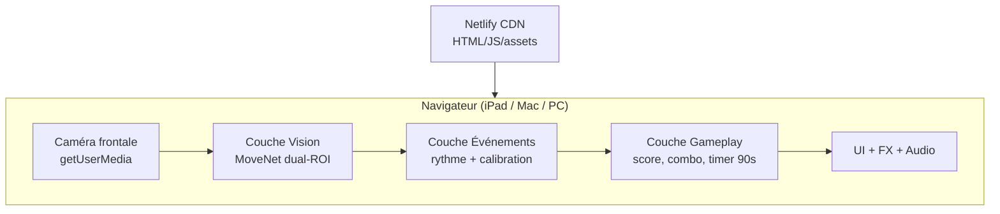

# Row Battle — Architecture technique (vision, événements, gameplay)

**Phase :** 1 (spécification) — alignée sur le choix moteur documenté dans `PHASE1-ETUDE-COMPARATIVE.md`  
**Principe directeur :** le gameplay ne dépend **jamais** du squelette ; il ne consomme que des **événements** typés.

---

## 1. Vue d’ensemble



| Couche | Responsabilité | Remplaçable sans toucher au jeu ? |
|--------|----------------|-----------------------------------|
| **Vision** | Frames → poses brutes par joueur | Oui |
| **Événements** | Poses → signaux → `StrokeDetected`, etc. | Oui (tuning) |
| **Gameplay** | Règles, score, combo, fin de partie | Non (cœur produit) |
| **Présentation** | Colonnes, particules, sons | Oui |

---

## 2. Déploiement Netlify (sans backend)

```
/
├── public/                 # Modèles optionnels (ou CDN TF Hub)
├── src/
│   ├── vision/             # Capture, ROI, MoveNet, workers
│   ├── events/             # Features, filtres, calibration, FSM rythme
│   ├── game/               # Session 90s, scoring, combo
│   ├── ui/                 # HUD, écrans, animations
│   └── audio/              # Web Audio API, sons procéduraux ou samples
├── index.html
├── vite.config.ts
└── netlify.toml            # build, cache, headers
```

- **Build :** `npm run build` → dossier `dist/` publié par Netlify.  
- **Pas de fonctions Netlify** requises pour la v1.  
- **HTTPS obligatoire** pour `getUserMedia`.  
- **Cache long** sur WASM/modèles ; **cache bust** sur `index-*.js`.

Headers utiles si WASM multithread (à valider selon bundle) :

```toml
[[headers]]
  for = "/*"
  [headers.values]
    Cross-Origin-Opener-Policy = "same-origin"
    Cross-Origin-Embedder-Policy = "require-corp"
```

---

## 3. Couche Vision

### 3.1 Moteur

- Package : `@tensorflow-models/pose-detection`  
- Modèle : `MoveNet` + `modelType: SINGLEPOSE_LIGHTNING`  
- **Deux instances logiques** (une par joueur), idéalement **deux Web Workers** partageant le même poids modèle en mémoire (ou un worker qui traite les deux ROI séquentiellement si GPU saturé).

### 3.2 Découpage spatial (dual-ROI)

```
┌─────────────────────────────────────────┐
│  ROI Joueur 1 (≈ 0–48 % largeur)       │  ROI Joueur 2 (≈ 52–100 %)
│         🧑 rameur gauche                  │         🧑 rameur droit
└─────────────────────────────────────────┘
           caméra frontale (iPad)
```

- Marge centrale (~4 %) pour éviter les chevauchements de bbox.  
- Chaque ROI est redimensionnée à l’entrée MoveNet (192×192).  
- **Repli :** une seule passe `MULTIPOSE_LIGHTNING` + association par `centroid.x < 0.5 * width`.

### 3.3 Boucle temps réel

1. `requestAnimationFrame` ou timer aligné caméra (~30 Hz capture).  
2. Copie frame → `OffscreenCanvas` / `ImageBitmap` vers workers.  
3. Workers : `estimatePoses` → landmarks + scores.  
4. Post message : `{ playerId, landmarks, timestamp, inferenceMs }`.  
5. Thread principal : envoi à la couche Événements (jamais au gameplay direct).

### 3.4 Backend TF.js

Ordre de tentative suggéré :

1. `webgl` (Mac Chrome, Android)  
2. `wasm` (SIMD si disponible)  
3. `cpu` (dernier recours iOS problématique)

Mesurer au boot : si pas de frame en < 3 s, basculer.

---

## 4. Couche Événements

### 4.1 Contrat (API interne)

```typescript
// Exemple de contrat — à implémenter en Phase 2

type PlayerId = "player1" | "player2";

type GameEvent =
  | { type: "StrokeDetected"; player: PlayerId; strength: number; at: number }
  | { type: "ComboLost"; player: PlayerId; at: number }
  | { type: "PlayerIdle"; player: PlayerId; at: number }
  | { type: "PlayerActive"; player: PlayerId; at: number }
  | { type: "CalibrationProgress"; player: PlayerId; progress: number; phase: "wait" | "strokes" | "ready"; strokesDone: number; strokesRequired: number }
  | { type: "CalibrationDone"; player: PlayerId; profile: PlayerRhythmProfile };

interface PlayerRhythmProfile {
  periodMs: number;           // période médiane des coups
  amplitudeNorm: number;      // amplitude typique (normalisée)
  thresholds: { stroke: number; idle: number };
}
```

Le gameplay s’abonne via `onGameEvent(handler)` ou bus léger (EventTarget).

### 4.2 Features (multi-signaux)

Par joueur, à partir des landmarks MoveNet :

| Feature | Calcul (idée) | Rôle |
|---------|---------------|------|
| `torsoScale` | distance épaules (normalisée par largeur ROI) | profondeur avance/recul |
| `bustCompression` | nez → milieu épaules | phase du coup |
| `armDrive` | moyenne hauteur poignets + angles coudes | bras / occlusion partielle |
| `torsoVelocity` | dérivée du centre (épaules + hanches) | énergie du mouvement |

- Ignorer les points avec `score < 0.3` (seuil ajustable).  
- **Ne jamais** déclencher un coup sur un seul landmark.

### 4.3 Filtrage temporel

- **One Euro Filter** (ou EMA double) sur chaque feature.  
- Détection de coup : passage de phase (ex. minimum local de `bustCompression` suivi d’un maximum) + **fenêtre refractory** (~40 % de la période calibrée) pour éviter les doubles triggers.

### 4.4 Calibration automatique (15 s + 10 coups + départ)

Au démarrage de partie (écran « Essai des rames ») :

1. **15 s de préparation** (chrono global) : mesure du calme / bruit caméra.  
2. **10 coups** de rame reconnus (décompte 10 → 1 par joueur).  
3. Calcul par joueur : période médiane, amplitude, `noiseAmp`, `minStrokeAmp`, seuils `stroke` / `idle`.  
4. Quand **tous** les joueurs actifs ont fini : décompte **3 · 2 · 1 · EN MER**, puis `CalibrationDone` / début de partie.

Aucun réglage manuel.

### 4.5 Machine à états par joueur

```
IDLE ──(mouvement > seuil)──► ACTIVE
ACTIVE ──(coup valide)──► StrokeDetected → ACTIVE
ACTIVE ──(trop long sans coup régulier)──► ComboLost (côté gameplay) + PlayerIdle
```

La **régularité** (écart à la période attendue) est calculée ici ou dans le gameplay ; les `ComboLost` sont émis quand l’irrégularité dépasse une tolérance **immédiate** (combo à zéro).

---

## 5. Couche Gameplay

### 5.1 Session

- Durée fixe : **90 000 ms** (`performance.now()` ou horloge dédiée).  
- États : `calibrating` → `playing` → `results`.

### 5.2 Score (concept)

- Chaque `StrokeDetected` : `basePoints × multiplier`.  
- Multiplier : paliers **×1, ×2, ×3, ×5, ×10** selon combo maintenu.  
- Combo ++ si intervalle entre coups ∈ `[period × (1 − ε), period × (1 + ε)]` (ε ~ 15–20 % après calibration).  
- **Sinon :** combo = 0 immédiatement (`ComboLost`).

Métriques fin de partie :

- Score total  
- Combo max  
- Nombre de coups  
- Régularité (%) = coups dans la fenêtre / total coups  
- Précision du rythme (écart-type normalisé des intervalles)

### 5.3 Isolation

- Aucun import de `@tensorflow/*` dans `src/game/`.  
- Tests unitaires possibles sur le scoring avec flux d’événements simulés.

---

## 6. Présentation (UI / FX)

### 6.1 Layout

```
┌──────────────────────────────────────────────────┐
│  SCORE J1          [ 0:45 ]          SCORE J2   │
│  COMBO x3                            COMBO x2   │
├──────────┬──────────────────────────┬───────────┤
│ BARRE    │                          │    BARRE  │
│ ÉNERGIE  │    zone feedback /       │  ÉNERGIE  │
│ J1       │    particules            │      J2   │
└──────────┴──────────────────────────┴───────────┘
```

- Gros chiffres, contraste élevé, lisible à distance.  
- Animations via CSS transforms + canvas particules (ou lib légère type canvas 2D maison).

### 6.2 Feedback par événement

| Événement | Feedback |
|-----------|----------|
| `StrokeDetected` | flash colonne, particules, tick score, SFX |
| Combo ↑ | intensité FX (×2 étincelles → ×5 explosion → ×10 écran vivant) |
| `ComboLost` | court « break » visuel (pas punitif au point de frustrer) |

### 6.3 Fin de partie

- Overlay victoire / comparaison scores.  
- Bouton **Rejouer** (recharge l’essai des rames).

---

## 7. Audio

- **Web Audio API** : sons courts (< 200 ms) pour coups ; layers pour combo.  
- Débloquer audio sur premier geste utilisateur (contrainte iOS).  
- Pas de streaming externe requis (fichiers dans `public/sfx/`).

---

## 8. Performance & qualité de service

| Objectif | Cible |
|----------|--------|
| FPS inférence | ≥ 24 par joueur effectif (dual-ROI ou multipose) |
| Latence événement | < 80 ms après mouvement réel (filtre inclus) |
| Time-to-play | < 30 s après ouverture URL (chargement + permission caméra + calibration) |
| Durée session | 90 s sans dégradation > 20 % FPS |

Stratégies :

- Créer les détecteurs **une fois**.  
- Réutiliser tenseurs / canvases.  
- Option « qualité réduite » : inférence 1 frame sur 2, interpolation des features.

---

## 9. Sécurité & vie privée

- Vidéo **locale** ; pas d’upload par défaut.  
- Mention courte dans l’UI : « La caméra reste sur votre appareil ».  
- Pas de cookies tiers requis.

---

## 10. Roadmap d’implémentation (Phase 2+)

1. Scaffold Vite + TypeScript + Netlify.  
2. Vision dual-ROI + workers + métriques FPS à l’écran debug (masquable).  
3. Couche événements + calibration (repos + 5 coups).  
4. Gameplay 90 s + scoring.  
5. UI/FX/audio.  
6. Tests sur iPad Safari + Mac Chrome.  
7. Retrait debug ; documentation README joueur.

---

## 11. Référence choix moteur

Voir **`docs/PHASE1-ETUDE-COMPARATIVE.md`** — choix : **MoveNet SinglePose Lightning (dual-ROI)**, repli **MoveNet MultiPose Lightning**.
